# Majehub Monorepo

Welcome to **Majehub**, a high-performance, multi-tenant e-commerce marketplace platform built using a modern TypeScript microservices architecture managed with **Nx** and powered by **Bun**.

---

## 1. Project Overview

Majehub is an enterprise-grade e-commerce marketplace consisting of three frontend portals (User Client, Seller Panel, Admin Dashboard) and a suite of decoupled backend microservices. The architecture is designed for scale, resilience, and real-time user engagement:

- **Customer Experience**: Advanced search/category navigation, secure checkout via Stripe, real-time messaging with sellers, and machine learning-driven personalized recommendations.
- **Seller Panel**: Shop setup, category and inventory management, stripe onboarding, and live order tracking.
- **Admin Portal**: Platform-wide configuration, moderation, and live system log streaming.
- **Microservices Engine**: Asynchronous telemetry, modular code reuse via shared libraries, high-performance caching, and resilient database queries.

---

## 2. Architecture Diagram

Below is the high-level system architecture illustrating the user flows, API routing, asynchronous event streaming, real-time channels, and database topology:

```mermaid
graph TD

%% =========================
%% CLIENT LAYER
%% =========================
subgraph Clients["Client Applications"]
    U_UI["User UI (Next.js) :3000"]
    S_UI["Seller UI (Next.js) :3001"]
    A_UI["Admin UI (Next.js) :3002"]
end

%% =========================
%% EDGE LAYER
%% =========================
GW["API Gateway (Express) :8080"]

%% =========================
%% MICROSERVICES LAYER
%% =========================
subgraph Services["Microservices Layer"]
    Auth_Svc["Auth Service :6001"]
    Prod_Svc["Product Service :6002"]
    Sell_Svc["Seller Service :6003"]
    User_Svc["User Service :6004"]
    Order_Svc["Order Service :6005"]
    Admin_Svc["Admin Service :6006"]
    Chat_Svc["Chat Service (WS) :6007"]
    Log_Svc["Logger Service :6008"]
    Rec_Svc["Recommendation Service :6009"]
end

%% =========================
%% EVENT STREAMING
%% =========================
subgraph Kafka["Kafka Event Streaming"]
    Topic_Log["log topic"]
    Topic_Event["user-event topic"]
    Topic_Chat["messages topic"]
end

K_Worker["Kafka Analytics Worker"]

%% =========================
%% DATA LAYER
%% =========================
subgraph Data["Data Layer"]
    MongoDB[("MongoDB")]
    Redis[("Redis Cache")]
end

%% =========================
%% CLIENT → GATEWAY
%% =========================
U_UI --> GW
S_UI --> GW
A_UI --> GW

%% =========================
%% GATEWAY ROUTING
%% =========================
GW --> Auth_Svc
GW --> Prod_Svc
GW --> Sell_Svc
GW --> User_Svc
GW --> Order_Svc
GW --> Admin_Svc
GW --> Rec_Svc
GW --> Chat_Svc

%% =========================
%% REAL-TIME COMMUNICATION
%% =========================
U_UI <-->|WebSocket Chat| Chat_Svc
S_UI <-->|WebSocket Chat| Chat_Svc
A_UI <-->|WebSocket Logs| Log_Svc

%% =========================
%% EVENT STREAMING FLOWS
%% =========================
Auth_Svc --> Topic_Log
Prod_Svc --> Topic_Log
Sell_Svc --> Topic_Log
User_Svc --> Topic_Log
Order_Svc --> Topic_Log
Admin_Svc --> Topic_Log
Chat_Svc --> Topic_Log

GW --> Topic_Event
Auth_Svc --> Topic_Event
Prod_Svc --> Topic_Event
Sell_Svc --> Topic_Event
User_Svc --> Topic_Event
Order_Svc --> Topic_Event
Admin_Svc --> Topic_Event
Chat_Svc --> Topic_Event

Chat_Svc --> Topic_Chat

%% =========================
%% CONSUMERS
%% =========================
K_Worker --> Topic_Event
Log_Svc --> Topic_Log
Chat_Svc --> Topic_Chat

K_Worker --> MongoDB

%% =========================
%% DATABASE ACCESS
%% =========================
Auth_Svc --> MongoDB
Prod_Svc --> MongoDB
Sell_Svc --> MongoDB
User_Svc --> MongoDB
Order_Svc --> MongoDB
Admin_Svc --> MongoDB
Chat_Svc --> MongoDB
Rec_Svc --> MongoDB

%% =========================
%% CACHE
%% =========================
Chat_Svc --> Redis
```



---

## 3. Monorepo Structure

The workspace is organized into **apps** (end-user applications and microservices) and **packages** (shared internal utility libraries):

```text
majehub/
├── apps/
│   ├── admin-service/           # Admin statistics & moderation backend
│   ├── admin-ui/                # Next.js admin dashboard portal
│   ├── api-gateway/             # Central reverse proxy & rate-limiter
│   ├── auth-service/            # Authentication, JWT, and session backend
│   ├── chatting-service/        # WebSocket chat backend (User <-> Seller)
│   ├── kafka-service/           # Background event processor daemon
│   ├── logger-service/          # WebSocket consumer streaming system logs
│   ├── order-service/           # Order placement, cart management & Stripe checkout
│   ├── product-service/         # Product catalog, listings & search api
│   ├── recommendation-service/  # TensorFlow.js recommendation engine
│   ├── seller-service/          # Seller registration & stripe merchant onboarding
│   ├── seller-ui/               # Next.js seller panel portal
│   ├── user-service/            # User profile management backend
│   └── user-ui/                 # Next.js customer-facing store client
├── packages/
│   ├── error-handler/           # Unified API errors & global handler middleware
│   ├── middleware/              # Auth guards (Authentication & Role Verification)
│   └── lib/                     # Database and messaging clients
│       ├── imagekit/            # ImageKit API integration for media uploads
│       ├── kafka/               # Kafka client wrapper configured with Aiven SSL certs
│       ├── prisma/              # Prisma Client generator & database operations
│       ├── redis/               # Redis adapter setup referencing Upstash URI
│       ├── shared-types/        # Shared TypeScript interfaces & types
│       └── utils/               # Log publishing & shared utility functions
├── prisma/
│   └── schema.prisma            # MongoDB database models & associations
├── nx.json                      # Nx monorepo execution pipeline config
├── package.json                 # Monorepo workspaces & devDependencies
└── tsconfig.base.json           # Global compilerOptions & paths overrides
```

---

## 4. Services Overview

| Service Name               |  Port  | Description                                                                                                                                                             | Primary Dependencies                                      |
| :------------------------- | :----: | :---------------------------------------------------------------------------------------------------------------------------------------------------------------------- | :-------------------------------------------------------- |
| **api-gateway**            | `8080` | Single entrypoint; provides rate-limiting, CORS handling, cookie routing, and forwards requests to underlying microservices.                                            | `express`, `express-http-proxy`, `express-rate-limit`     |
| **auth-service**           | `6001` | Handles signups, logins, token issuance (Access & Refresh JWT), and session invalidation. Generates API Swagger documentation.                                          | `express`, `jsonwebtoken`, `bcrypt`, `swagger-ui-express` |
| **product-service**        | `6002` | Manages products, categories, catalogs, inventory stocks, search tags, reviews, and detailed attributes.                                                                | `express`, Prisma client                                  |
| **seller-service**         | `6003` | Manages merchant registrations, shop details, opening hours, merchant profiles, and integrates Stripe onboarding.                                                       | `express`, `stripe`                                       |
| **user-service**           | `6004` | Handles customer account configurations, shipping address catalogs, and profile preferences.                                                                            | `express`, Prisma client                                  |
| **order-service**          | `6005` | Processes order items, tracks shipment status, validates coupon codes, and processes credit card payments via Stripe.                                                   | `express`, `stripe`                                       |
| **chatting-service**       | `6007` | Dual-purpose WebSocket and HTTP API server facilitating real-time chat between users and shop sellers. Messages are published to Kafka for async batch database writes. | `ws`, `express`, `kafkajs`                                |
| **logger-service**         | `6008` | WebSocket-enabled service subscribing to the Kafka `log` topic and broadcasting system logs to connected Admin UI dashboards.                                           | `ws`, `express`, `kafkajs`                                |
| **recommendation-service** | `6009` | Collects customer analytics data and trains an embedding-based neural network model to calculate personalized shopping recommendations.                                 | `@tensorflow/tfjs`                                        |
| **kafka-service**          | _N/A_  | Background event consumer parsing messages from the `user-event` topic and aggregating analytics metrics across shops and products.                                     | `kafkajs`, Prisma client                                  |
| **admin-service**          | `6006` | Provides administrative overrides, platform configuration adjustments, and user/seller moderation.                                                                      | `express`, Prisma client                                  |

---

## 5. Shared Libraries

Majehub packages are stored under the `/packages` folder and compiled directly alongside the microservices to reduce redundancy:

1. **`error-handler`**
   - Standardized application exceptions (`ValidationError`, `AuthError`, `NotFoundError`, `ServerError`).
   - Unified Express error middleware returning structured JSON responses to clients.
2. **`middleware`**
   - `isAuthenticated`: Validates JWT cookies or bearer authorization headers.
   - `authorizeRole`: RBAC wrapper to enforce access limits (`User`, `Admin`, `Seller`).
3. **`lib/kafka`**
   - Central Kafka connection client utilizing Aiven connection brokers.
   - Handles loading SSL certificates (`ca.pem`, `service.cert`, `service.key`) dynamically based on env configuration.
4. **`lib/prisma`**
   - Instantiates and exports a singleton instance of the `PrismaClient` using the paths mapped inside `generated/prisma/client`.
5. **`lib/redis`**
   - Exports the `ioredis` Client configured to connect to Upstash Redis database.
6. **`lib/imagekit`**
   - Pre-configured ImageKit Node.js Client instance facilitating product or avatar photo uploads.
7. **`lib/utils`**
   - `sendLog`: Background utility for sending structured system logs to the Kafka `log` topic.
8. **`lib/shared-types`**
   - Hosts global types, Express Request overrides, and model configurations used across multiple services.

---

## 6. Technology Stack

- **Monorepo Manager**: [Nx](https://nx.dev/) (version 22)
- **Runtime Environment**: [Bun](https://bun.sh/)
- **Programming Language**: [TypeScript](https://www.typescriptlang.org/) (ES2022)
- **Database Engine**: [MongoDB Atlas](https://www.mongodb.com/atlas) (Schema managed via [Prisma ORM](https://www.prisma.io/))
- **Event Streaming Broker**: [Aiven Kafka](https://aiven.io/kafka)
- **Caching**: [Upstash Redis](https://upstash.com/)
- **Frontend Framework**: [Next.js](https://nextjs.org/) (React 19)
- **Styling**: TailwindCSS & Styled Components
- **Machine Learning**: [TensorFlow.js](https://js.tensorflow.org/)
- **Payment Processing**: [Stripe API](https://stripe.com/)

---

## 7. Local Development Setup

### Prerequisites

- Install **Bun** on your operating system.
- Prepare a **MongoDB Connection URI**.
- Provide **Aiven Kafka Certificates** (`ca.pem`, `service.cert`, `service.key`) and keep them inside a directory.

### Step 1: Install Dependencies

Run the following command in the root folder to download all required modules:

```bash
bun install
```

### Step 2: Configure Environment Files

Copy the `.env` configuration file to the root of your workspace:

```bash
cp .env.example .env
```

Ensure you update the configuration settings (refer to [Section 8](#8-environment-variables)).

### Step 3: Generate Prisma Client

Majehub uses a custom output location for the Prisma ORM. Build the client using:

```bash
bunx prisma generate
```

### Step 4: Launch Dev Servers

To start the entire backend service cluster at once:

```bash
bun run dev
```

To run individual frontend portals, execute the specific portal scripts:

```bash
# Customer Frontend (Next.js)
bun run user-ui

# Seller Portal (Next.js)
bun run seller-ui

# Admin Dashboard (Next.js)
bun run admin-ui
```

---

## 8. Environment Variables

Create a `.env` file in the root workspace. Below are the required values:

```env
# Database Credentials
DATABASE_URL="mongodb+srv://<user>:<password>@cluster.mongodb.net/majehub_db?retryWrites=true&w=majority"

# ImageKit Configuration (for avatar/product image uploads)
IMAGEKIT_PUBLIC_KEY="public_xxx"
IMAGEKIT_PRIVATE_KEY="private_xxx"
IMAGEKIT_URL_ENDPOINT="https://ik.imagekit.io/xxx"

# Kafka Client Configurations
KAFKA_CERTS_PATH="C:/Users/User/sul-ecom/majehub/avienCertificate"

# Payment Gateways (Stripe Setup)
STRIPE_SECRET_KEY="sk_test_xxx"
STRIPE_WEBHOOK_SECRET="whsec_xxx"

# Token Verification Secrets
ACCESS_TOKEN_SECRET="supersecret_access_token_key"
REFRESH_TOKEN_SECRET="supersecret_refresh_token_key"

# SMTP Email Configurations (Nodemailer Setup)
SMTP_HOST="smtp.gmail.com"
SMTP_PORT="587"
SMTP_SERVICE="gmail"
SMTP_USER="example@gmail.com"
SMTP_PASSWORD="app-specific-password"

# Nx Engine Tweaks
NX_REJECT_UNKNOWN=0
```

---

## 9. Running Individual Services

Nx allows you to target individual projects. You do not need to run everything at once if you are only developing a single feature:

```bash
# Start API Gateway
bunx nx serve api-gateway

# Start Authentication Service
bunx nx serve auth-service

# Start Product Service
bunx nx serve product-service

# Start Seller Service
bunx nx serve seller-service

# Start User Service
bunx nx serve user-service

# Start Order Service
bunx nx serve order-service

# Start Chatting Service
bunx nx serve chatting-service

# Start Logging Service
bunx nx serve logger-service

# Start Recommendation Service
bunx nx serve recommendation-service

# Start background Kafka worker
bunx nx serve kafka-service

# Start UI Portals individually
bunx nx dev user-ui
bunx nx dev seller-ui
bunx nx dev admin-ui
```

---

## 10. Docker Setup

Since there is no default Dockerfile in the repository, you can containerize Majehub using standard Dockerfiles.

### Multi-Stage Dockerfile for Express Backend Services

Create a `Dockerfile` under the service directory (e.g., `apps/auth-service/Dockerfile`):

```dockerfile
FROM node:20-alpine AS builder
WORKDIR /app
COPY package.json bun.lock nx.json tsconfig.base.json ./
RUN npm install -g bun
RUN bun install
COPY . .
RUN bunx nx build auth-service

FROM node:20-alpine
WORKDIR /app
COPY package.json bun.lock ./
RUN npm install -g bun && bun install --production
COPY --from=builder /app/apps/auth-service/dist ./dist
COPY --from=builder /app/generated ./generated
ENV NODE_ENV=production
EXPOSE 6001
CMD ["node", "dist/main.js"]
```

### Multi-Stage Dockerfile for Next.js Frontends

Create a `Dockerfile` under the UI folder (e.g., `apps/user-ui/Dockerfile`):

```dockerfile
FROM node:20-alpine AS builder
WORKDIR /app
COPY package.json bun.lock nx.json tsconfig.base.json ./
RUN npm install -g bun
RUN bun install
COPY . .
RUN bunx nx build user-ui

FROM node:20-alpine AS runner
WORKDIR /app
ENV NODE_ENV=production
COPY --from=builder /app/apps/user-ui/.next ./.next
COPY --from=builder /app/apps/user-ui/public ./public
COPY --from=builder /app/apps/user-ui/package.json ./package.json
RUN npm install -g bun && bun install --production
EXPOSE 3000
CMD ["bun", "run", "start"]
```

### Root Docker Compose Configuration

You can spin up local support services (like MongoDB and Kafka) using a root `docker-compose.yml`:

```yaml
version: '3.8'

services:
  mongodb:
    image: mongo:6.0
    ports:
      - '27017:27017'
    volumes:
      - mongo_data:/data/db

  redis:
    image: redis:7-alpine
    ports:
      - '6379:6379'

volumes:
  mongo_data:
```

---

## 11. Build Commands

We build apps using standard Nx workspace configurations. Nx only builds modified projects and utilizes remote caching to speed up pipelines.

```bash
# Build a specific app (e.g., api-gateway)
bunx nx build api-gateway

# Build all applications in the monorepo
bunx nx run-many --target=build --all

# Build all production apps (excluding tests & assets)
bunx nx run-many --target=build --all --configuration=production
```

---

## 12. Testing Commands

Majehub uses **Jest** for unit and integration test executions.

```bash
# Run tests for a specific microservice (e.g., auth-service)
bunx nx test auth-service

# Run tests across all workspace projects
bunx nx run-many --target=test --all

# Run tests and watch for file modifications
bunx nx test auth-service --watch
```

---

## 13. CI/CD Workflow

The repository includes a GitHub Actions pipeline configured under [.github/workflows/ci.yml](file:///c:/Users/User/sul-ecom/majehub/.github/workflows/ci.yml):

- **Triggering Events**: Triggers on pushes to the `main` branch and all pull requests.
- **Environment**: Runs on `ubuntu-latest` nodes powered by **Node 20**.
- **Nx Cloud Integration**: Accelerates steps by distributing test execution runs across three concurrent machines (`3 linux-medium-js` agents).
- **Execution Chain**:
  1. Checks code formatting: `npx nx-cloud record -- npx nx format:check`
  2. Runs workspace targets concurrently: `npx nx run-many -t lint test build typecheck e2e-ci`
  3. Corrects build caching warnings automatically via `npx nx fix-ci`.

---

## 14. API Documentation Links

Backend REST services utilize **Swagger UI** for routing schema documentation.

- **Swagger Generation**:
  Run `bun run auth-docs` to build swagger schemas from route configurations.
- **Interactive Documentation**:
  Start the services and visit the relative OpenAPI routes:
  - Auth Service Schema: `http://localhost:6001/api-docs`
  - Auth Service raw JSON: `http://localhost:6001/docs-json`

---

## 15. Deployment Architecture

In staging/production, Majehub uses a microservices deployment topology:

- **Ingress Gateway**: Cloud Load Balancer routes traffic to the API Gateway.
- **Service Hosting**: Microservices run as containers in a Kubernetes Cluster (AWS EKS or GCP GKE) or Serverless Container environment (AWS ECS/Google Cloud Run).
- **Static Assets**: Frontend portals are deployed to Vercel/Netlify, or packaged as Docker containers cached behind a CDN (Cloudflare/CloudFront).
- **Distributed Database**: Managed MongoDB Atlas Replica Set handles database persistence.
- **Managed Kafka & Redis**: Serverless databases (Aiven/Confluent Kafka, Upstash Redis) provide messaging buffers and session tracking.

---

## 16. Troubleshooting

### 1. Kafka Certificate Resolution Error

**Symptom**: Services crash during startup with `ENOENT: no such file or directory, open '.../avienCertificate/ca.pem'`.
**Solution**:

1. Check that the folder path exists on your workspace.
2. In the `.env` file, specify the absolute path for the directory using forward slashes (e.g., `KAFKA_CERTS_PATH="C:/Users/User/sul-ecom/majehub/avienCertificate"`).

### 2. Prisma Model Imports Failing in IDE

**Symptom**: VS Code displays red lines under imports pointing to `@packages/lib/prisma`.
**Solution**:
Uncomment the path configuration mappings inside the [tsconfig.base.json](file:///c:/Users/User/sul-ecom/majehub/tsconfig.base.json) compiler options:

```json
"paths": {
  "@packages/*": ["packages/*"]
}
```

### 3. Upstash Redis Connection Intermittent Drops

**Symptom**: System logs show Redis connectivity failures.
**Solution**:
Upstash URIs use the SSL secure protocol (`rediss://`). Ensure your Node runtime supports TLS connections and check that your local firewall permits outbound connections on port `6379`.

---

## 17. Contributing Guidelines

1. **Branch Naming**:
   Use standard prefixes for branch development:
   - `feat/feature-name` for new enhancements.
   - `fix/bug-name` for patches.
   - `docs/doc-name` for documentation.
2. **Generating New Libraries**:
   Generate an Nx publishable workspace package using:
   ```bash
   npx nx g @nx/js:lib packages/<package-name> --publishable --importPath=@org/<package-name>
   ```
3. **Pre-commit Checks**:
   Always run linting, code formatting, and test suites locally before pushing commits:
   ```bash
   bunx nx format:write
   bunx nx run-many -t lint test typecheck
   ```
